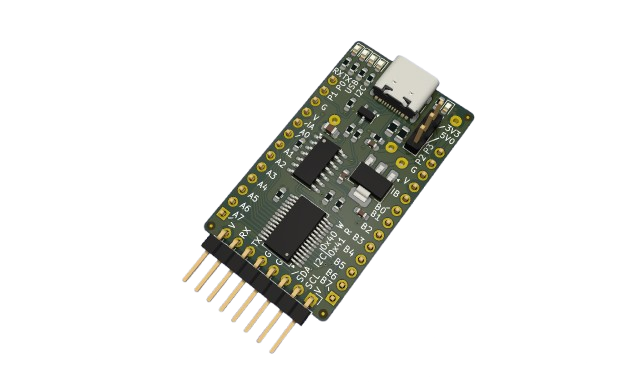
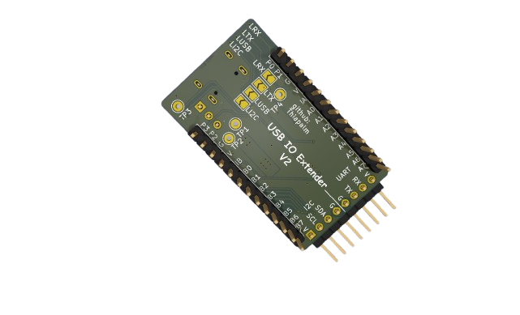

# USB to IO Extender Board

 
 

This is a hobby development board conceived for usage in my home lab. The board can be used as USB to serial adapter with no need to install any driver on the PC. It can be used as USB to I2C adapter and also USB to GPIO port extender. For the two later options, some code development may be necessary.  

The board has 4 extra GPIO ports that can be used as LED indicators (if the back jumpers are soldered). The board power is provided by the USB connector, and it can be used in 5V or 3V3 modes for serial, I2C and GPIO pins. 

## License and certification

This is an open source hardware project licensed under CERN-OHL-P. More details on [LICENSE.md](./LICENSE.md).  

This project is certified by OSHW: [Certification BR000019](https://certification.oshwa.org/br000019.html)

## Project

The PCB project was developed in Kicad 9, all necessary project files are available in this repository and can be used freely, according to License.

## Board specifications

The board is based on the [**MCP2221**](https://www.microchip.com/en-us/product/MCP2221), and [**MCP23017**](https://www.microchip.com/en-us/product/MCP23017) from Microchip.  
Board features commonly used in Embedded Systems:
- USB-C connector
- I²C serial communication
- UART serial communication
- LED indicators (UART-TX, UART-RX, I²C, USB-Config and board power ON) or 4 extra GPIOs
- 16 GPIOs (5V or 3V3)
- Board power selector (5V / 3V3)
- The GPIO pins are breadboard compatible

## Board View 

  

## Version Revision

V1 - Not Published  
   - Added MCP23017 GPIOs on the header  
   - Added Jumper selector on LEDs  
   - Added Output voltage selection  
   - Added MCP2221 serial on Header  
   - Added MCP2221 I2C on Header   

V2 - Current Version
   - Changed USB connector to USB-C

## Firmware

There is no specific firmware for this board, but i have a driver developed in RUST for MCP23017 for use in embedded environments, see it in [crates.io](https://crates.io/crates/mcp23017-tp).

Also, you can use the IOExtender Control Center which is a software that can be used to control the I²C communication via Windows/Linux/Mac machines [iocc software](https://github.com/Thiapalm/iocc).

## Contribution

Unless you explicitly state otherwise, any contribution intentionally submitted for inclusion in the work by you, as defined in the CERN-OHL-P license, shall be licensed as above, without any additional terms or conditions.
